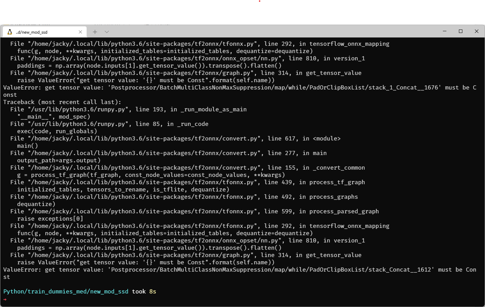
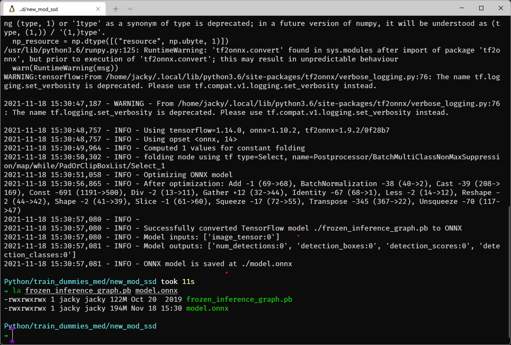
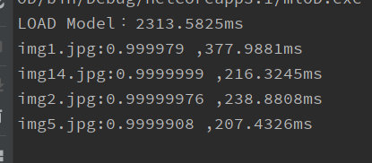
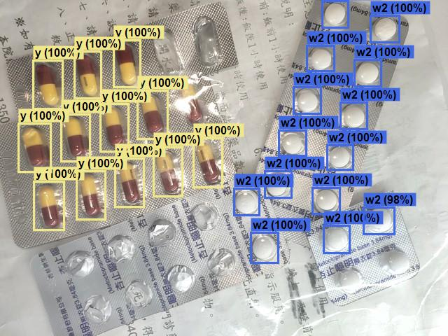
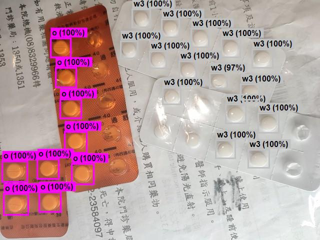
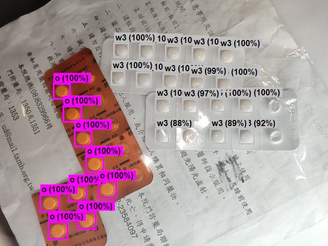
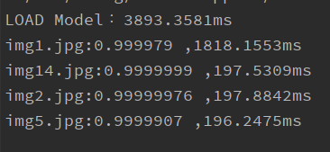

# ML.net Object Detection

> 使用Tensorflow Model轉換成onnx格式後在ML.net上辨識

---

### 轉換模型

使用模組:Tesorflow 1.14 ssd resnet50v1

安裝tensorflow,[tf2onnx](https://github.com/onnx/tensorflow-onnx)

> pip install tensorflow
> pip install -U tf2onnx

```python3
python3 -m tf2onnx.convert --graphdef ./frozen_inference_graph.pb --output ./model.onnx --fold_const --opset 14 --inputs image_tensor:0 --outputs num_detections:0,detection_boxes:0,detection_scores:0,detection_classes:0
```

* input和ouput可以透過[summarize_graph](https://github.com/onnx/tensorflow-onnx/blob/master/README.md#tool-to-get-graph-inputs--outputs)
工具查看
* opset 指定為14 (實測12以上就可轉換成功),如果轉換失敗(如下圖)將opset指定最新版本試試
  
  轉換成功，大小多了70多MB
  

### 環境

* [Microsoft.ML](https://www.nuget.org/packages/Microsoft.ML/)
* [Microsoft.ML.ImageAnalytics](https://www.nuget.org/packages/Microsoft.ML.ImageAnalytics/)
* [Microsoft.ML.OnnxTransformer](https://www.nuget.org/packages/Microsoft.ML.OnnxTransformer/)
* [Microsoft.ML.OnnxRuntime](https://www.nuget.org/packages/Microsoft.ML.OnnxRuntime)
  或 [Microsoft.ML.OnnxRuntime.Gpu](https://www.nuget.org/packages/Microsoft.ML.OnnxRuntime.Gpu)

### 辨識

在執行檔位置新增assets資料夾，在assets底下再新增以下資料夾：

* model 模型檔存放位置
* img 放欲辨識的圖片
* output 辨識完成的圖片

#### Cpu辨識(AMD 5900x):







##### Gpu辨識(RTX2060 6G):

需要安裝帶有gpu的OnnxRuntime，和安裝需求版本以上的[CUDA、cuDNN](https://onnxruntime.ai/docs/execution-providers/CUDA-ExecutionProvider.html#requirements)

在ApplyOnnxModel時要指定使用的gpu ID

*測試時OnnxRuntime 1.9.0 無法正常讀取此模組，降版到 1.8.1後正常*



辨識結果與cpu一樣
